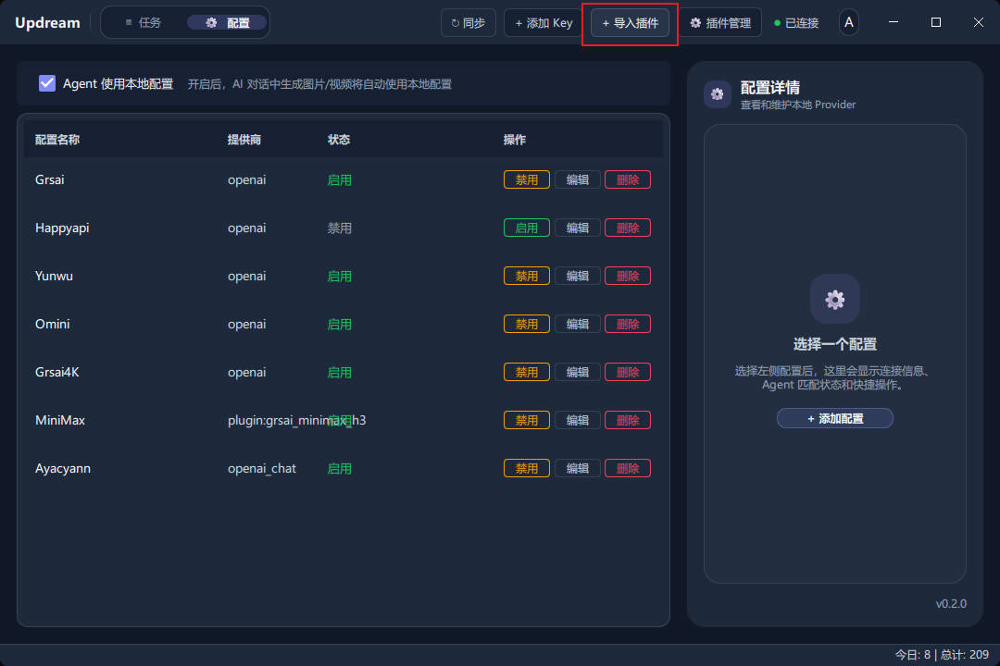
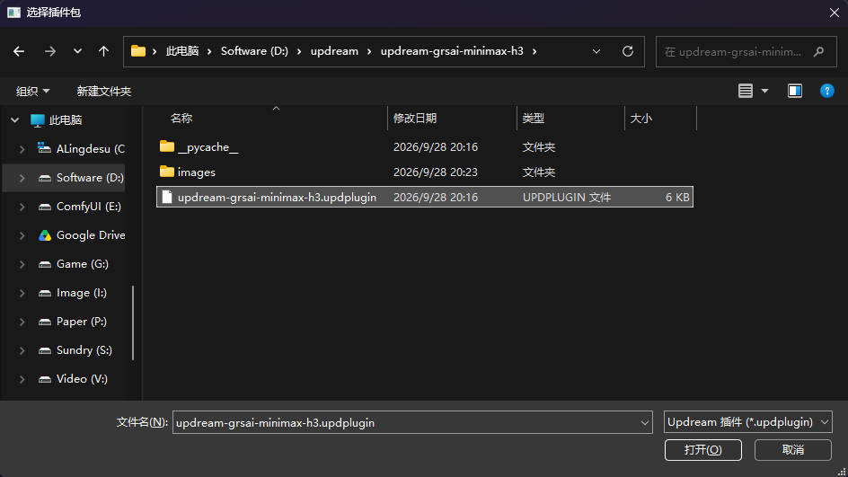
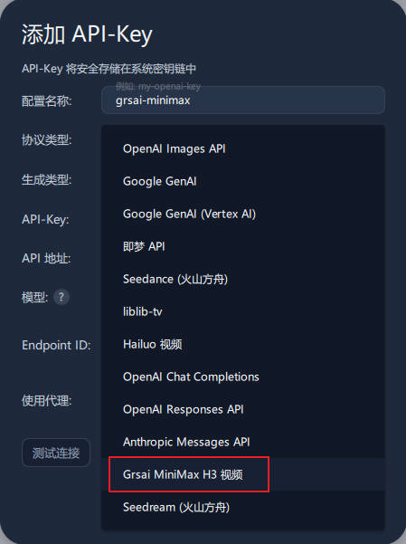
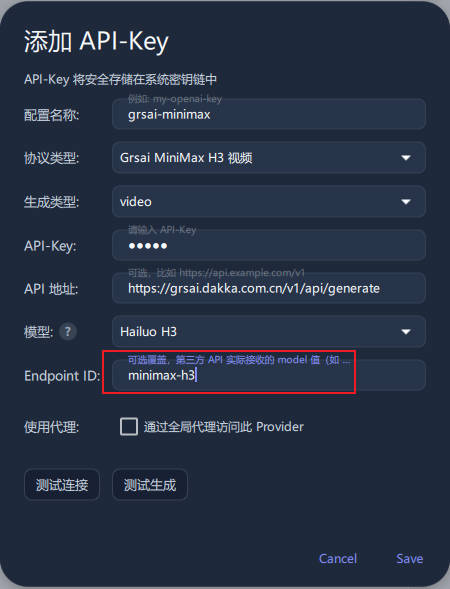
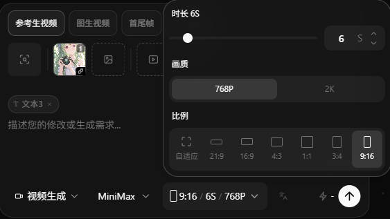

# Updream Grsai MiniMax H3 视频插件

这是一个用于 [Updream](https://github.com/) 的视频生成插件，通过 Grsai API 调用 MiniMax H3 视频模型。

插件安装后，Updream 的协议列表中会出现：

> **Grsai MiniMax H3 视频**

插件内部标识为 `plugin:grsai_minimax_h3`，当前插件版本为 **1.3.0**。

## 功能

- 通过 Grsai API 生成 MiniMax H3 视频。
- 支持文生视频，以及 Updream 传入的参考图片和参考音频。
- 按当前 Updream 界面提供两档画质：`768P` 和 `2K`。
- `768P` 会发送为 Grsai 的 `768p`，最长 **15 秒**。
- `2K` 会发送为 Grsai 的 `1080p`，最长 **10 秒**。
- 当前界面比例只使用 `16:9`（横屏）和 `9:16`（竖屏）。
- 自动提交任务并轮询生成结果，最长轮询约 29 分钟。

## 下载

普通使用者只需要下载并安装下面的文件，不需要单独下载 Python 源码：

- [`updream-grsai-minimax-h3.updplugin`](../updream-grsai-minimax-h3.updplugin)

`.updplugin` 文件已经包含插件运行所需的 `manifest.json`、`plugin.py` 和说明文件。

如果通过 GitHub Releases 下载，请选择对应版本的 `.updplugin` 文件。

## 使用前准备

1. 安装支持第三方插件的 Updream 桌面版。
2. 准备可用的 Grsai API Key。
3. 确认 Grsai 账户可以调用 MiniMax H3 视频模型。
4. 确保电脑能够访问配置的 Grsai API 地址。

API Key 不要写入 README、截图、代码或 Git 提交记录。Updream 会在保存配置时将 API Key 存入系统凭据存储。

## 安装插件

### 1. 导入插件包

打开 Updream 的 **配置** 页面，点击右上角 **导入插件**。



在文件选择窗口中选择下载的 `updream-grsai-minimax-h3.updplugin` 文件。



按照 Updream 的安装确认提示完成安装。插件安装完成后，可以在 **插件管理** 中查看、卸载或查看日志。

如果已经安装过同名旧版本，建议先在插件管理中卸载 `grsai_minimax_h3`，再安装新版本；也可以根据 Updream 的提示选择覆盖安装。

### 2. 添加视频配置

在 Updream 的配置页面点击 **添加 Key**，在 **协议类型** 中选择：

> **Grsai MiniMax H3 视频**



按下面的方式填写：

| 配置项 | 建议值 |
| --- | --- |
| 配置名称 | 自定义，例如 `grsai-minimax-h3` |
| 协议类型 | `Grsai MiniMax H3 视频` |
| 生成类型 | `video` |
| API-Key | 你的 Grsai API Key |
| API 地址 | `https://grsai.dakka.com.cn/v1/api/generate` |
| 模型 | 可以选择界面中的视频模型选项 |
| Endpoint ID | `minimax-h3` |

API 地址也可以只填写服务根地址：

```text
https://grsai.dakka.com.cn
```

插件会自动补全以下接口路径：

```text
POST /v1/api/generate
GET  /v1/api/result?id=<task_id>
```

模型字段最终会统一使用 `minimax-h3`。建议将 **Endpoint ID** 明确填写为 `minimax-h3`，避免模型下拉框显示名称与 Grsai 实际模型名不一致。



填写完成后，建议依次点击 **测试连接** 和 **测试生成**，确认配置有效后保存。

## 画质、时长和比例

当前 Updream 视频生成面板的实际选项如下：

| Updream 画质 | API 参数 | 最大时长 |
| --- | --- | ---: |
| `768P` | `768p` | 15 秒 |
| `2K` | `1080p` | 10 秒 |

当前界面比例与 API 参数的对应关系：

| Updream 比例 | API 参数 | 含义 |
| --- | --- | --- |
| `16:9` | `landscape` | 横屏 |
| `9:16` | `portrait` | 竖屏 |

为了兼容旧版 Updream 或其他调用方，插件也会自动转换这些输入：

- `720p` → `768p`
- `768P` → `768p`
- `2K` → `1080p`
- `1K` → `1080p`
- 无效或未填写的画质 → `768p`

当请求的时长超过对应画质上限时，插件会自动截断，不会把超出上限的值发送给 API。



> 上图是当前 Updream 的实际选项。插件会在请求发送前执行画质归一化、比例转换和时长限制。

## 支持的请求参数

插件接收 Updream 的视频请求，并转换成 Grsai 请求格式。

| Updream 参数 | Grsai 参数 | 说明 |
| --- | --- | --- |
| `prompt` | `prompt` | 视频描述文本 |
| `size`、`resolution`、`quality`、`video_quality` | `resolution` | `768P` 转为 `768p`，`2K` 转为 `1080p` |
| `duration` | `duration` | `768p` 最多 15 秒，`1080p` 最多 10 秒 |
| `aspect_ratio`、`aspectRatio` | `aspectRatio` | `16:9` 转为 `landscape`，`9:16` 转为 `portrait` |
| `reference_images` | `images` | 最多 9 张，重复地址会去重 |
| `audios`、`reference_audios`、`audio_urls` | `audios` | 最多 3 个，重复地址会去重 |

插件内部也接受 `portrait` / `landscape`、`vertical` / `horizontal` 和中英文横竖屏名称，但当前 Updream 界面只提供 `16:9` 和 `9:16` 两个比例选项。

如果没有明确传入比例且存在参考图片，插件会读取第一张图片的宽高：宽度大于等于高度时使用横屏，否则使用竖屏。

## 任务处理

插件向 Grsai 提交异步任务，固定使用：

```json
{
  "replyType": "async"
}
```

提交后，插件会根据任务 ID 请求结果接口，并每 5 秒检查一次状态。成功后返回视频 URL；如果 API 返回失败、违规或无法识别的状态，Updream 会显示失败信息。

插件清单中的执行超时为 1800 秒，用于覆盖较长的视频生成和轮询过程。

## 常见问题

### 插件导入后看不到协议

打开 **插件管理** 检查 `grsai_minimax_h3` 是否已经安装。若同名旧版本存在，先卸载旧版本，再重新导入 `.updplugin` 文件并重启 Updream。

### 提示缺少 API Key

编辑配置，确认 **API-Key** 已填写且没有多余空格。API Key 不要填入 Endpoint ID 或 API 地址输入框。

### 请求返回 401 或 403

通常表示 API Key 无效、已过期，或当前账户没有对应模型权限。请在 Grsai 控制台确认 Key 状态和余额/权限。

### 请求返回 404

检查 API 地址。可以填写完整地址：

```text
https://grsai.dakka.com.cn/v1/api/generate
```

也可以填写根地址：

```text
https://grsai.dakka.com.cn
```

不要把 `/v1/api/result` 填进 API 地址。

### 模型无法生成

确认 Endpoint ID 为：

```text
minimax-h3
```

界面中的模型显示名称不一定等于 Grsai API 实际使用的模型名。

### 生成时间较长或超时

视频生成时间由 Grsai 服务端负载、素材数量和画质决定。插件默认最长轮询约 29 分钟；可以在 Updream 的插件管理中查看插件日志，重点检查提交响应、任务 ID 和轮询状态。

### 2K 不能生成超过 10 秒

这是插件的预设限制。选择 `2K` 时，插件会将画质转换为 `1080p`，超过 10 秒的请求会自动按 10 秒发送；如需最长 15 秒，请选择 `768P`。

## 项目文件

```text
updream-grsai-minimax-h3/
├─ manifest.json       # Updream 插件清单
├─ plugin.py           # 插件入口和 Grsai API 适配逻辑
├─ README.md           # 使用说明
└─ images/             # GitHub README 截图

updream-grsai-minimax-h3.updplugin  # 可直接导入 Updream 的安装包
```

### manifest.json 关键字段

```json
{
  "schema_version": 2,
  "kind": "script",
  "name": "grsai_minimax_h3",
  "label": "Grsai MiniMax H3 视频",
  "version": "1.3.0",
  "timeout": 1800,
  "generation_types": ["video"],
  "entry": "plugin.py"
}
```

## 重新打包

修改 `plugin.py` 或 `manifest.json` 后，可以使用 Python 重新生成 `.updplugin` 安装包：

```powershell
python -c "import zipfile; from pathlib import Path; root=Path('updream-grsai-minimax-h3'); out=Path('updream-grsai-minimax-h3.updplugin'); z=zipfile.ZipFile(out, 'w', zipfile.ZIP_DEFLATED); [z.write(root/name, name) for name in ('manifest.json', 'plugin.py', 'README.md')]; z.close()"
```

安装包至少应包含：

```text
manifest.json
plugin.py
README.md
```

不要把 API Key、个人配置文件、日志、`__pycache__` 或其他本地凭据打进安装包。

## 开发检查

修改代码后可以运行：

```powershell
python -m py_compile updream-grsai-minimax-h3/plugin.py
```

也可以检查安装包内容：

```powershell
python -c "import zipfile; print(zipfile.ZipFile('updream-grsai-minimax-h3.updplugin').namelist())"
```

## 免责声明

本项目是 Updream 的第三方插件适配器，不代表 Updream 或 Grsai 官方。视频生成是否成功、实际计费、模型可用性和 API 限制以 Grsai 服务端当前规则为准。
